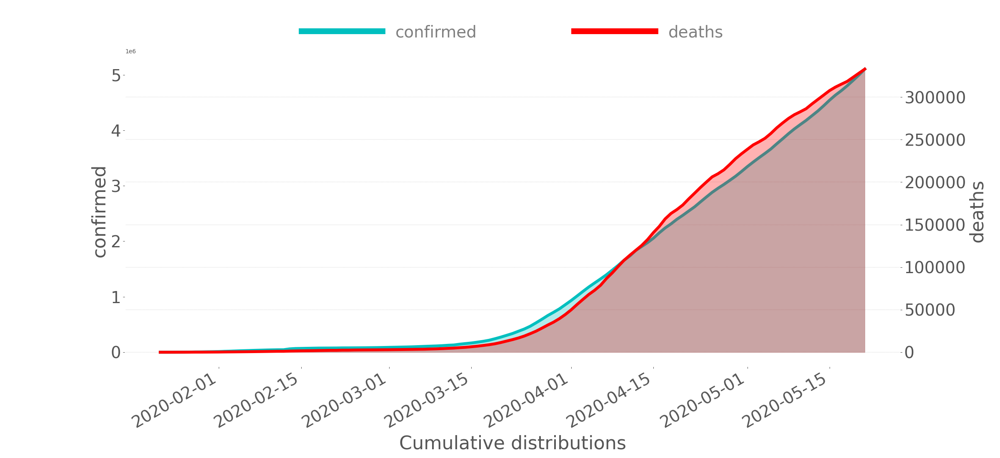

# COVID-19 Italy and World

## Cumulative distribution in the world

This repository has been created with the aim to perform some analysis with
the COVID-19 data of Italy and of the all world.

The data is updated daily at 6 a.m. from two repositories:
- World data: https://github.com/CSSEGISandData/COVID-19
- Italy data: https://github.com/pcm-dpc/COVID-19
 

Our first intent is to practice on statistical analysis. At first, We will focus
only on COVID data, then we would like to add other datasets that are likely
correlated with the virus phenomena, e.g. pollution and economic data.

Contributors: Andrea Aquilino, Stefano Valladares
